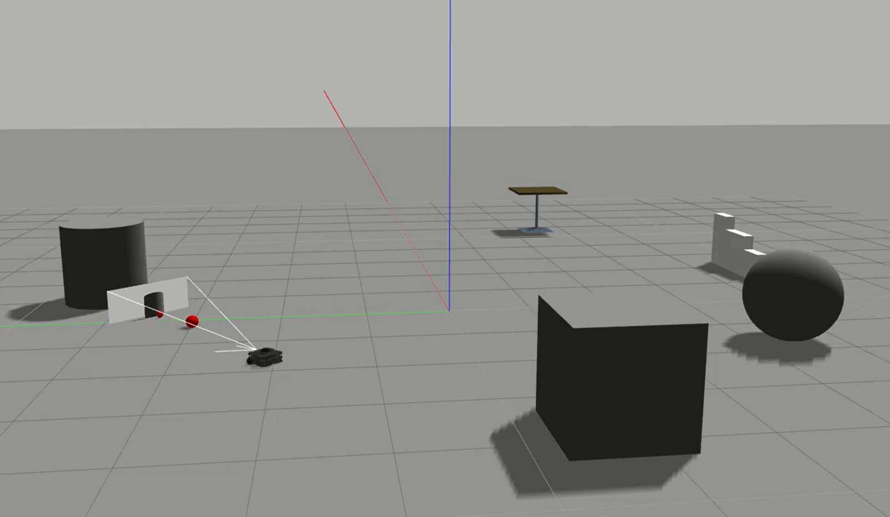
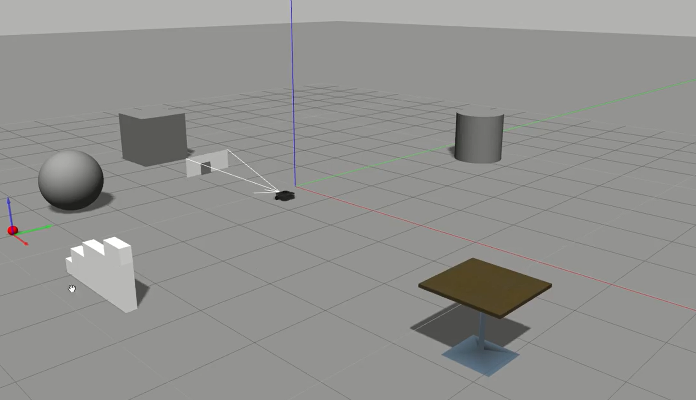

# Ball tracking

## Tasks
* Track a red ball with RGB camera.
* Move along to keep the ball in sight.
* If ball out of sight, rotate and search for it.
## Result
### Track orbiting ball

### Track ball at random position

## Reference
* [Tiziano Fiorenzani - ROS tutorial](https://github.com/tizianofiorenzani/ros_tutorials/tree/master/opencv)
